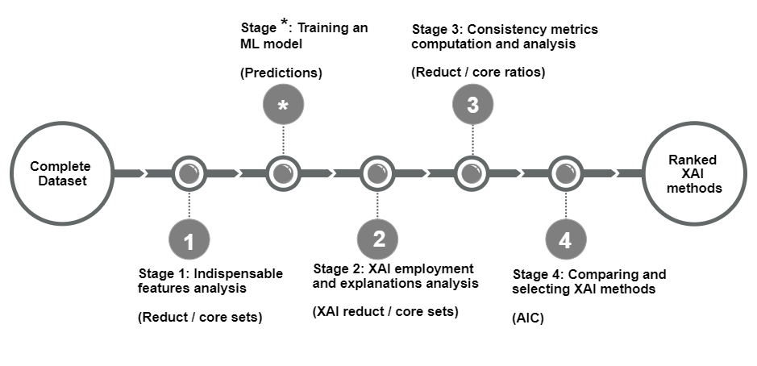

# ConsisXAI
The code in this repository is an implementation of the technique proposed in the paper with the title: "Evaluating Explainable Artificial Intelligence Methods Based on Feature Elimination: A Functionality-Grounded Approach". This repo contains an implementation of a technique to evaluate global machine learning explainability (XAI) methods based on feature subset consistency.

To be able to replicate the paper findings and results, follow this execution order:

1- Run the code in "definitions.py" to transform the data files from the datasets_files folder into a format to be used in our experiments.

2- From the "modeling" folder, run "params_optimisation.py" to obtain the best params for each ML model to be used.

3- Run "main.py" which includes models training, explanations generation, and explanations evaluations using our proposed approach.

-- "experiments.py" can be used to compute consistency ratios using the number of features in the intersection subset instead of their scores. This experiment is discussed in the paper.

please refer to our paper as: "Elkhawaga, Ghada, Omar Elzeki, Mervat Abuelkheir, and Manfred Reichert. 2023. "Evaluating Explainable Artificial Intelligence Methods Based on Feature Elimination: A Functionality-Grounded Approach" Electronics 12, no. 7: 1670. https://doi.org/10.3390/electronics12071670"

